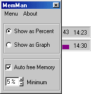



## MemMan

### Description

Automatic free your Physical Ram. Show the actual ramstatus as TrayIcon and free ram if its getting low. I get about 85% of free Ram on Win98 (installed 98 :-)
 
### More Info
 

             |
---                |---
**Submitted On**   |2003-03-22 02:21:18
**By**             |[Scythe](https://github.com/Planet-Source-Code/PSCIndex/blob/master/ByAuthor/scythe.md)
**Level**          |Intermediate
**User Rating**    |5.0 (20 globes from 4 users)
**Compatibility**  |VB 5\.0, VB 6\.0
**Category**       |[Complete Applications](https://github.com/Planet-Source-Code/PSCIndex/blob/master/ByCategory/complete-applications__1-27.md)
**World**          |[Visual Basic](https://github.com/Planet-Source-Code/PSCIndex/blob/master/ByWorld/visual-basic.md)
**Archive File**   |[MemMan1562963222003\.zip](https://github.com/Planet-Source-Code/scythe-memman__1-44181/archive/master.zip)

